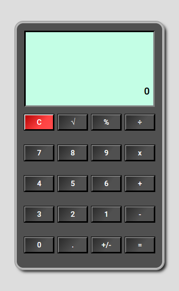

# Calculator
Simple calculator app. 
> Here is a working live [_demo_](https://alechowski.github.io/Calculator/).

## Table of Contents
* [General Info](#general-information)
* [Room for Improvement](#room-for-improvement)

## General Information
- The application was created to train JavaScript programming skills, and build something of my own from the scratch. 
Inspired by the look of classic scientific calculators.

     

## Room for Improvement
Expansion of the application towards a scientific calculator.
  

Room for improvement:
- Expand the application with new functions
- Support for the history of operations

---

 Created by alechowski

